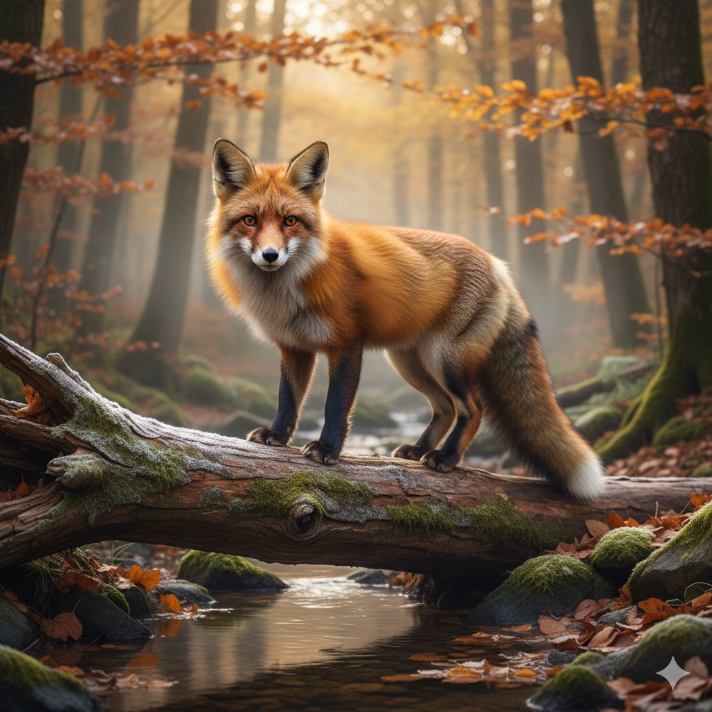

# 🍌 Banana Peel

Remove Gemini AI watermarks from images using **LaMa AI inpainting** — seamlessly, locally, and in one command.

> "Peel away those watermarks like a banana!"

## Features

- **AI-powered** — Uses the [LaMa](https://github.com/advimman/lama) inpainting model for seamless watermark removal
- **Zero config** — Model auto-downloads on first run (~198 MB, one-time)
- **Batch processing** — Process entire directories with parallel execution
- **Metadata preservation** — EXIF data is carried over to output files
- **Supports** PNG, JPG, JPEG, WebP, GIF, BMP, TIFF

## Samples

| Original | Watermark Removed |
| :---: | :---: |
|  |  |

## How It Works

Gemini adds a semi-transparent watermark logo to the bottom-right corner of generated images. Banana Peel:

1. **Detects** the watermark position using known mask patterns
2. **Inpaints** the area with the LaMa neural network, which "hallucinates" realistic content to fill the gap
3. **Blends** the result seamlessly using feathered alpha compositing

The AI model runs **100% locally** via ONNX Runtime — no cloud, no API keys, no data leaves your machine.

## Installation

### From Source

```bash
git clone https://github.com/neocorp/banana-peel.git
cd banana-peel
pip install .
```

### With Poetry (development)

```bash
git clone https://github.com/neocorp/banana-peel.git
cd banana-peel
poetry install
```

## Usage

### Single Image

```bash
banana-peel image.png
# Output: image_clean.png

# Overwrite original
banana-peel image.png --overwrite
```

### Directory (Batch Processing)

```bash
banana-peel ./photos/

# Custom suffix
banana-peel ./photos/ --suffix "_nowm"
```

### First Run

On the first run, Banana Peel will automatically download the AI model (~198 MB). This only happens once — subsequent runs are instant.

```
🍌 Banana Peel - First Run Setup
━━━━━━━━━━━━━━━━━━━━━━━━━━━━━━━
Downloading AI model (198 MB)... this only happens once.

Downloading lama_fp32.onnx ━━━━━━━━━━━━━━━━━━━━━ 100% 198.4/198.4 MB

✓ Model ready! Processing your image...
```

### Options

```
banana-peel <PATH> [OPTIONS]

Arguments:
  PATH           Image file or directory to process

Options:
  --overwrite    Overwrite original files
  --suffix TEXT  Custom suffix for output files [default: _clean]
  --version      Show version and exit
  --help         Show help message and exit
```

## Detection Rules

Banana Peel automatically detects watermark size based on image dimensions:

| Image Size | Watermark | Margins |
|---|---|---|
| > 1024×1024 | 96×96 px | 64 px |
| ≤ 1024×1024 | 48×48 px | 32 px |

The watermark is always positioned at the bottom-right corner.

## Development

```bash
git clone https://github.com/neocorp/banana-peel.git
cd banana-peel
poetry install
poetry run banana-peel --help
```

### Running Tests

```bash
poetry run pytest
```

## Credits

- **LaMa Model**: [Resolution-robust Large Mask Inpainting](https://github.com/advimman/lama) by Samsung AI
- **ONNX Model**: Based on the model from [dinoBOLT/Gemini-Watermark-Remover](https://github.com/dinoBOLT/Gemini-Watermark-Remover)
- **Watermark Masks**: From [journey-ad/gemini-watermark-remover](https://github.com/journey-ad/gemini-watermark-remover) and [allenk/GeminiWatermarkTool](https://github.com/allenk/GeminiWatermarkTool)

## License

MIT License — See [LICENSE](LICENSE) file for details.

## Disclaimer

**USE AT YOUR OWN RISK**

This tool modifies image files. While designed to work reliably, unexpected results may occur. The author assumes no responsibility for any data loss or unintended modifications.

## Limitations

- Only removes **Gemini visible watermarks** (the semi-transparent logo in bottom-right corner)
- Does not remove invisible/steganographic watermarks like [SynthID](https://support.google.com/gemini/answer/16722517)
- Designed for Gemini's current watermark pattern (as of 2026)
